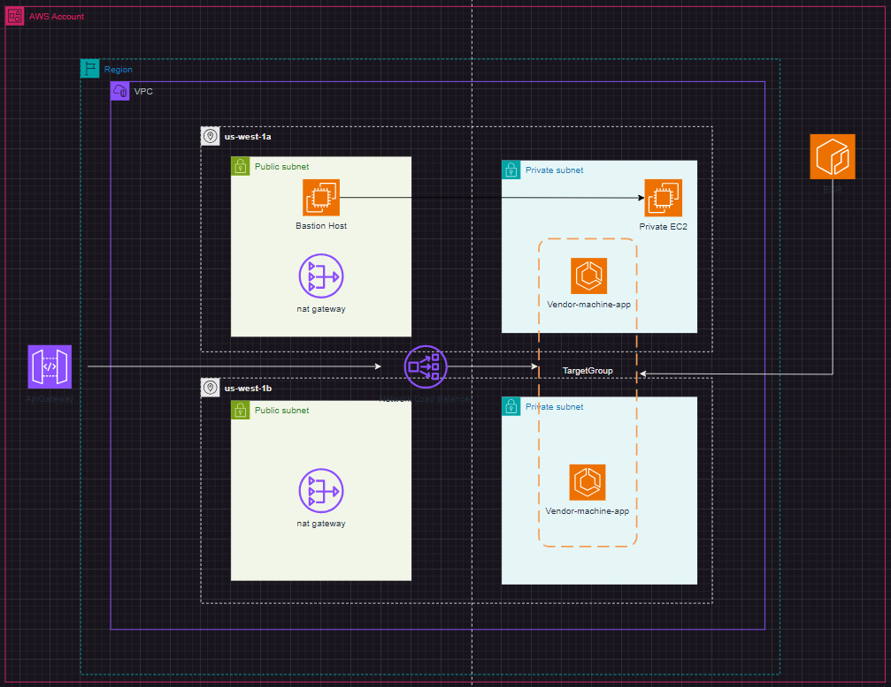

# vendor-machine-terraform
Repository for Terraform code to expose vendor-machine functions.

Prerequisites
- Terraform ≥ 1.0
- AWS CLI configured with credentials
- S3 backend for state management

IAM policies:
- AmazonECS_FullAccess
- AmazonAPIGatewayAdministrator
- SSH key pair for bastion access

Deployment
- First time you run the environment, initialize the project with the Makefile of "init" folder to manage Terraform state.
- Use "terraform init"  initializes the Terraform working directory and then "terraform apply" to apply changes to the infrastructure. Use the commands from the Makefile in each infrastructure folder in the right order.
- Order: 
(1) IAM
(2) Networking
(3) Compute
(4) Integration